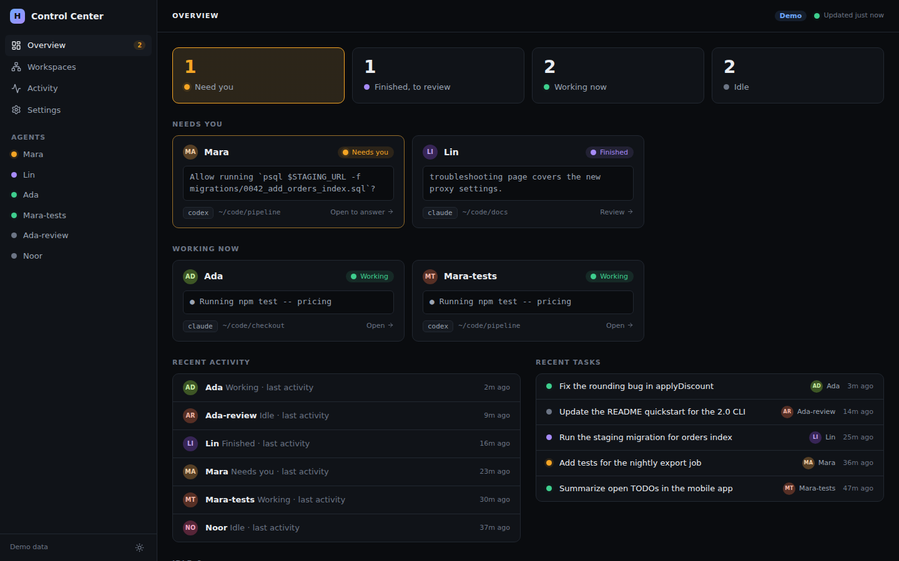
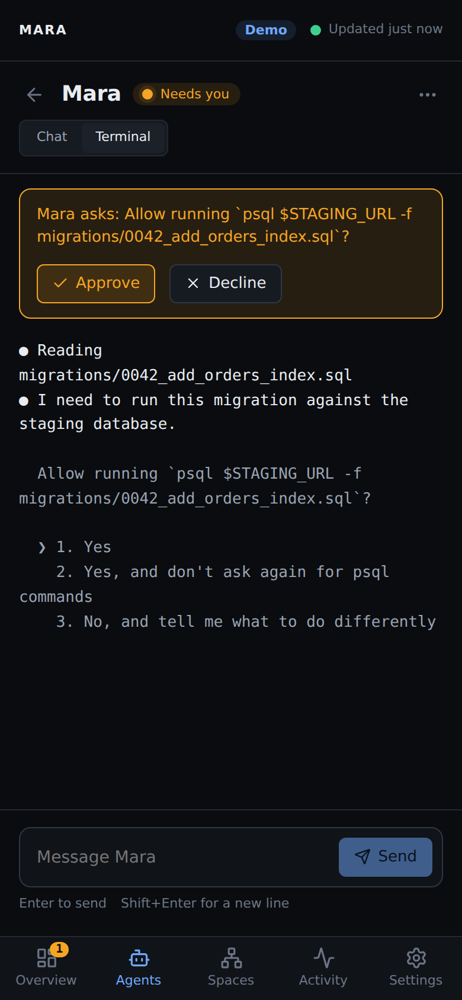
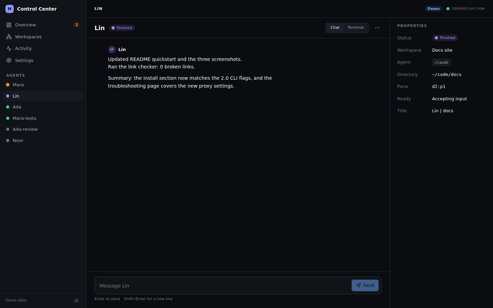

# Herdr Control Center (herdrcc)

A web interface for [Herdr](https://herdr.dev). See which of your coding agents
need you, read and answer their conversations, and do it from your phone or
laptop, on your own network.



> **Not affiliated with Herdr.** This is an independent client that talks to the
> `herdr` command on your machine.
>
> **Status: use at your own risk.** It works, it is tested, and it may not be
> actively maintained. It can send messages to your agents and approve their
> prompts, so read [SECURITY.md](SECURITY.md) before you expose it to anything
> but your own computer.

## What it does

- **Overview:** one screen that puts agents that are blocked or finished ahead
  of the ones that are idle, with a one-line summary of what each is doing.
- **Chat:** open an agent and read its conversation as messages (markdown,
  tables, collapsed "worked" steps) instead of terminal text. Send it a message
  from the box at the bottom.
- **Approve or decline:** when an agent is waiting on a permission prompt, the
  question is shown with Approve and Decline buttons.
- **Manage:** right-click an agent to rename it, close its pane, or archive it
  (hide it in your browser). Interrupt one that is working.
- **Terminal view:** the raw terminal text is one click away for anything chat
  cannot show.
- **From anywhere:** pair your phone or another computer over
  [Tailscale](https://tailscale.com) with a QR code.

| Needs you, on a phone | An agent's chat |
| --- | --- |
|  |  |

## Install

### As a Herdr plugin

```sh
herdr plugin install TayHCode/herdrcc
```

Herdr clones this repository and runs `npm ci` and `npm run build` for you (you
need [Node.js](https://nodejs.org) 20.19 or newer). It shows the commands first
and asks before running them. After that, Control Center appears as three
plugin panes in Herdr: **Control Center** (starts it), **Pair a device**
(prints a link and QR code) and **Run in background with remote access**.
To update, run the install command again and restart it. Plugins are not
sandboxed and not reviewed by Herdr; read the code first if you want to.

### From source

You need [Node.js](https://nodejs.org) 20.19 or newer. Herdr is only needed
for real use, not the demo.

```sh
git clone https://github.com/TayHCode/herdrcc.git
cd herdrcc
npm ci
npm run build
```

Everything below runs as `npm start -- <options>` from that folder (or
`node bin/herdrcc.js <options>`). If the package is published to
npm, `npx herdrcc <options>` does the same.

## Try it without Herdr

```sh
npm start -- --demo
```

Open the link it prints. The demo uses made-up agents; sending messages and
approving the prompt really changes the demo state, so you can try everything.

## Run it for real

Herdr must be installed with `herdr` on your `PATH`.

```sh
npm start
```

Open the link printed in the terminal. The link contains a private key for this
run, so treat the terminal output as secret.

## Use it from your phone or another computer

Remote access goes through Tailscale. Control Center never listens on your
network itself, and it refuses to run if Tailscale Funnel would make it public.

```sh
npm start -- --remote
```

It checks Tailscale, asks before sharing Control Center at an address only your
tailnet can reach, then prints a link and a QR code. Open that link on the other
device once to **pair** it. The device then stays paired until you revoke it in
**Settings**. Create more pairing codes any time with:

```sh
npm start -- pair
```

### Keep it running

```sh
npm start -- install-service --remote
```

This installs a background service (systemd on Linux, launchd on macOS) that
starts at login or boot. Remove it with `uninstall-service`. The service runs
the copy of Control Center you installed it from; reinstall it after you move or
update that copy.

The macOS service file is generated and unit-tested but has not been run on a
real Mac.

## How chat works, and where it can break

Herdr gives Control Center the terminal screen. To show a real conversation,
Control Center also reads the session logs that Codex and Claude Code keep on
the same machine (`~/.codex/sessions`, `~/.claude/projects`).

Those log formats are not public or stable. If one changes, chat for that agent
may look wrong or disappear; the Terminal tab keeps working. Agents on other
machines, and agents other than Codex and Claude Code, show the terminal only.

## Options

| Option | Meaning |
| --- | --- |
| `--demo` | Use made-up data, no Herdr needed |
| `--remote` | Share over Tailscale (tailnet only) |
| `--remote-port <n>` | HTTPS port on your tailnet address (default 10000) |
| `--port <n>` | Local port (default 4173) |
| `--yes` | Do not ask before changing Tailscale Serve |

Environment: `HERDR_CONTROL_CENTER_CLI` (path to `herdr`),
`HERDR_CONTROL_CENTER_PORT`, `HERDR_CONTROL_CENTER_STATE_DIR` (where paired
devices are kept; default `~/.config/herdrcc`).

## Custom groups (optional)

If you want a **Board** that groups your agents your own way, create
`~/.config/herdrcc/layouts.json`. It stays on your machine; nothing about it is
part of the app.

```json
{
  "sessions": {
    "default": {
      "groups": [
        { "title": "Builders", "names": ["Ada", "Lin"] },
        { "title": "Reviewers", "names": ["Noor"] }
      ]
    }
  }
}
```

Use a Herdr session's name as the key (or `default`). Agents are matched by
display name, ignoring case; anyone left over appears under "Other". A **Board**
entry then appears in the sidebar.

## Tested with

Linux, Herdr 0.9.1, Node 20.19 and 22 (the test suite runs on both in CI), and
agents running Codex and Claude Code. macOS, Windows, other Herdr versions and
other agents are untested. Pairing and remote access were checked over
Tailscale from a command line, so expect rough edges on real devices.

## Limits

- It controls agents only through Herdr. It does not start agents, edit Herdr's
  configuration, or open a shell.
- There are no tasks, dependencies or history of its own. Everything shown is
  read live from Herdr and the session logs.
- Archive hides an agent in that browser only.
- Windows is untested.

## Develop

```sh
npm ci
npm run dev        # or: npm run dev -- --demo
npm test
npm run typecheck
npm run build
```

See [CONTRIBUTING.md](CONTRIBUTING.md) and [docs/ARCHITECTURE.md](docs/ARCHITECTURE.md).

## License

MIT. See [LICENSE](LICENSE).
